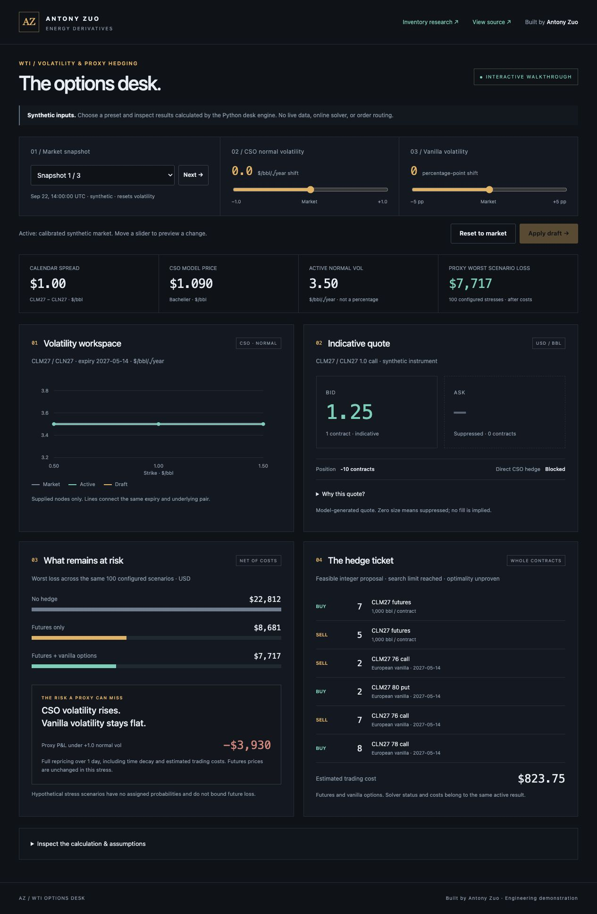
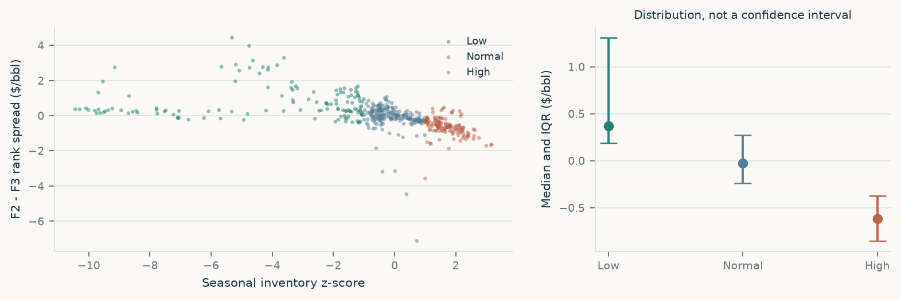

# WTI Options Desk & Cushing Inventory Research

**Antony Zuo (Yuang Zuo) · Independent commodities research**

Adjust volatility. Inspect the quote. Choose a proxy hedge. See what remains at risk.

[](https://yz3639-gif.github.io/cushing-wti-research/options-desk/)

[Inventory research](https://yz3639-gif.github.io/cushing-wti-research/research/) · [Python engine](options_lab/README.md) · [Validation & limits](options_lab/VALIDATION.md) · [Demo case checks](docs/options-desk/verification.json)

No installation or sign-in. The public desk selects **45 precomputed Python-engine cases using synthetic inputs**; it does not use live market data or run an online optimizer.

[](https://yz3639-gif.github.io/cushing-wti-research/options-desk/)

*Actual application view. Built by Antony Zuo. Hypothetical scenario losses are net of estimated costs; they are not historical performance or loss bounds.*

## Try the desk in 30 seconds

1. Select **Snapshot 1**, then move **CSO normal volatility** to **+1.0**. Preview compares the stored case at the same market prices and positions.
2. Click **Apply draft**. Model price, indicative quote, hedge ticket and residual risk update together from one result bundle.
3. Compare **No hedge**, **Futures only** and **Futures + vanilla options**. Inspect the stress where CSO volatility rises while vanilla volatility stays flat. Direct CSO hedging is blocked.

| Explore | What it demonstrates | Evidence boundary |
|---|---|---|
| [WTI Options Desk](https://yz3639-gif.github.io/cushing-wti-research/options-desk/) | Volatility workflow, indicative quotes, integer proxy hedges and residual scenario risk | Synthetic inputs; 45 precomputed evaluations; bounded-search feasible proposals |
| [Cushing inventory research](https://yz3639-gif.github.io/cushing-wti-research/research/) | Inventory conditions, calendar spreads and historical stability checks | 481 matched public-data observations; descriptive and exploratory research |

## WTI Options Desk: implementation and limits

The complete [WTI Options Desk](options_lab/README.md) is an independent local Python/Streamlit tool for editable CSO and vanilla volatility, indicative quotes, integer proxy hedges and residual stress risk. It includes portable sessions, historical evaluation of the desk policy and regression tests. [Validation evidence and limits](options_lab/VALIDATION.md) · [Optional CI template](options_lab/ci/options-desk.yml.example)

Real options-data acceptance, empirical hedge improvement and live-feed acceptance remain pending. This extension does not change the inventory research results below and is not included in the original v1.0.0 research ZIP. [Public demo details and reproduction](options_lab/DEPLOY.md)

## Cushing inventory research

How does Cushing inventory relative to its seasonal history relate to the WTI curve, and where does that relationship break down?

[Read the four-page memo](https://yz3639-gif.github.io/cushing-wti-research/research_memo.pdf) · [Explore the report](https://yz3639-gif.github.io/cushing-wti-research/research/) · [View the notebook](research_walkthrough.ipynb) · [Three-minute research guide](docs/PORTFOLIO_GUIDE.md)

[Download the original research package](https://github.com/yz3639-gif/cushing-wti-research/releases/latest) — reports, data snapshot, source code and reproduction instructions.

### Research answer

**Lower seasonal inventories coincide with stronger nearby WTI spreads in the pooled history. Evidence for additional nonlinear shape is weak after controlling for year and season.** Inventory provides context for investigating physical conditions; these results do not establish a profitable trading rule.

| Evidence from the public-data sample | Result |
|---|---:|
| Matched inventory releases, January 2015–April 2024 | 481 |
| Spearman correlation: seasonal inventory anomaly versus F2−F3 | −0.729 |
| Median spread in Low / High inventory states | +$0.37 / −$0.62 per barrel |
| Joint test of two fixed slope changes, with year and season controls | HAC p = 0.775308 |



*Public EIA F2−F3 quotes describe delivery ranks. They do not identify a fixed pair of tradable contracts. Each inventory release is matched to an available quote strictly before its publication date.*

The nonlinear extension was specified **after inspecting the original descriptive summaries** and is exploratory. Omitting year controls or excluding 2018 changes the inference substantially. The main p-value does not prove linearity or economic irrelevance. [Methods and full sensitivities](docs/MECHANISM_EXTENSION.md)

## What the cases teach

- **2020 — receiving constraints:** On April 15, inventory remained seasonally Normal after a 16.520-million-barrel four-week build. The label could not reveal uncommitted storage or the ability to receive delivery.
- **2023 — different turning points:** The preceding spread fell from $1.67 to $1.14/barrel between the spread-peak and inventory-trough release records. Low stocks did not pin the spread at its peak.
- **2019 — a weak year:** Within-year rank correlation was approximately +0.079. The strong pooled pattern did not hold uniformly.

The report links these cases to dated sources. Peak and trough labels are retrospective.

## Scope and evidence status

**Completed with real public data:** publication-dated EIA inventory reconstruction, seasonal features, descriptive relationships, exploratory D1/D2 regressions, uncertainty checks and source-linked cases.

**Implemented and tested, awaiting verified market inputs:** actual-month M2−M3 selection, B0–B3 Ridge comparisons, chronological validation and contract-level daily trade accounting. Software tests use artificial fixtures; their forecasts and P&L are not research findings.

Two original questions remain open:

- **H2:** Does inventory improve future spread forecasts beyond observable market information?
- **H3:** Does any improvement cover two-leg trading costs?

Verified actual-contract settlements, expiry dates and a settlement calendar are still missing. Results are therefore `public_evidence_only`, with no real forecast-performance or trading-return claim. The nationwide inventory control is disabled pending harmonization of EIA's October 2016 lease-stock definition change. [Input requirements](docs/BLOOMBERG_EXPORT.md)

## Read and inspect

| Artifact | Purpose |
|---|---|
| [Four-page PDF](outputs/research_memo.pdf) · [editable memo](outputs/research_memo.md) | Question, findings, cases and limits |
| [Offline HTML report](outputs/report.html) | Event selection, source records and precomputed sensitivities; download and open locally |
| [Notebook](research_walkthrough.ipynb) | Walkthrough from source audit to interpretation |
| [English/Chinese interview notes](outputs/interview_notes.md) | Concise explanation and follow-up questions |
| [Technical appendix](docs/TECHNICAL_APPENDIX.md) · [research protocol](docs/RESEARCH_PROTOCOL.md) | Methods, timing rules and accounting conventions |
| [Results](outputs/results.json) · [data audit](outputs/data_audit.json) · [run manifest](outputs/run_manifest.json) | Machine-readable evidence, source checks and version identity |

PDF, HTML and text read from one saved result set. The HTML bundles its chart library. Public quote history ends in April 2024; later inventory updates do not extend the matched spread sample.

## Reproduce

Use **Python 3.12** and the pinned dependencies. **Node.js 22** runs the report's JavaScript regression checks; GitHub Actions installs both runtimes. From the repository root:

```bash
python3.12 -m venv .venv
.venv/bin/python -m pip install -r requirements.lock.txt
make reproduce
```

Individual stages: `make validate`, `make build`, `make report` and `make test`. These use the checked-in snapshot; missing sources, checksum mismatches and stale manifests stop the relevant stage.

`make notebook` executes the walkthrough, `make check` verifies matching artifacts, and `make package` produces a ZIP with a SHA-256 manifest. [Automated research checks](https://github.com/yz3639-gif/cushing-wti-research/actions/workflows/research.yml) rebuild the results and run the test suite in a fresh Linux environment.

To validate future actual-contract inputs:

```bash
.venv/bin/python -m cushing_research validate --scope full --offline
```

Full validation is expected to fail until those market inputs pass. Follow the [export specification](docs/BLOOMBERG_EXPORT.md). To retrieve new source versions, preserve the existing snapshot first, then use `fetch --refresh`. [Data fields](docs/DATA_DICTIONARY.md) · [Module interfaces](docs/INTERFACES.md)

## Repository map

```text
cushing_research/           Data, features, models, ledger and reporting
config/                    Fixed research and exploratory-extension settings
data/raw/                  Public source snapshots and provenance
data/processed/            Normalized public tables and audits
data/input/                Interface for locally supplied contract data
docs/                      Protocol, methods, export specification and reading guide
outputs/                   Research results, figures, PDF and offline report
scripts/                   Notebook execution, release checks and packaging
tests/                     Source, timing, model and accounting checks
research_walkthrough.ipynb  Reproducible analysis walkthrough
```

## Interpretation and data use

A seasonal score does not measure usable tank space. Checksums establish local snapshot consistency, not immutable publication history. Settlement simulations cannot establish intraday fill quality or capital returns without further assumptions.

Original public sources are attributed in the data and reports. Proprietary terminal exports are excluded from this repository and must remain subject to their provider's terms. This is an independent research project with no affiliation to Glencore. [Release notes](docs/RELEASE_NOTES.md)
