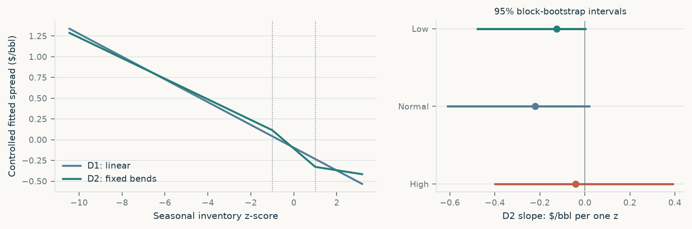
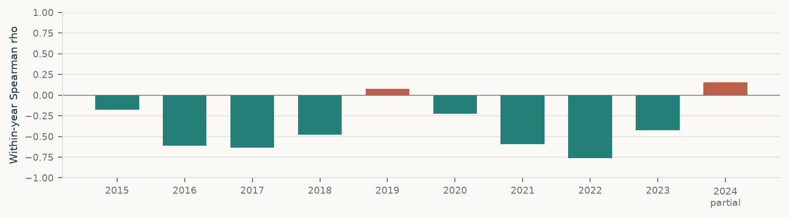

# Cushing Inventory Stress

## Physical balances and the WTI calendar spread

**Author:** Yuang Zuo  
**Evidence status:** Public mechanism research; actual-contract forecasting and trading evidence remain untested.  
**Inventory cutoff:** 14 Sep 2026  
**Result version:** 902e770aeb2ecdab  
**Generated:** 2026-09-15T16:27:00.957224+00:00

## 1. Research answer

### Seasonal stocks describe curve states; nonlinear evidence is weak after year controls.

Across 481 publication observations, the median F2-F3 quote is +0.37 USD/bbl in low-inventory states and -0.62 in high-inventory states (rank correlation -0.73). This historical association varies across years. The exploratory joint test does not provide sufficient evidence of a shape difference beyond the linear controlled relationship. Actual monthly contract data is still required to test incremental forecasting value and trading costs.

**Question.** How does Cushing inventory relative to its seasonal history relate to the WTI curve, and where does that relationship break down?

The matched descriptive sample contains 481 observations from 07 Jan 2015 to 03 Apr 2024. The Spearman correlation between inventory pressure and the preceding valid public F2-F3 rank spread is -0.729. This links a new inventory publication to an already-existing curve, not to a future holding-period outcome.

The exploratory joint test does not provide sufficient evidence of a shape difference beyond the linear controlled relationship. D2 versus D1 joint HAC test: p = 0.7753; common n = 481. The test concerns the historical spread level after year and seasonal controls.

Predictive and trading evidence is pending because verified actual-contract market inputs are not yet available. No conclusion about forecast skill follows from this missing test.

## 2. Define the physical state and information set

z = (reported inventory - historical seasonal mean) / historical seasonal standard deviation. The reference uses the previous three calendar years, within 28 days either side of the same point in the year, and at least 20 observations known by the release cutoff. Low: z < -1; High: z > 1; Normal: -1 to +1. Low means below the historical seasonal reference, not a physical operating minimum or a capacity utilization measure.

The public spread is **F2 minus F3**, in USD per barrel. A positive value means the second listed delivery month is dearer than the third; a negative value means the third is dearer. Rank labels change with contract succession. Their difference is useful for a market-state description, but a rank change is not a fixed-contract investment return.

**Chronology:** the observation week records when stocks were measured. The actual release date controls when they become known. The descriptive study pairs each release to its last valid preceding public quote. The quote therefore predates the new stock information; this is neither a release-response test nor a forward-return test.

**Physical mechanism:** deliverable barrels, accessible receiving space and flow capacity influence the relative value of earlier delivery. Aggregate stock does not reveal lease commitments, operational access, injection rates or forthcoming replenishment. A statistical state calls for a specific physical check; it does not identify an executable storage trade.

| State | Releases | Median $/bbl | 25th percentile | 75th percentile |
|---|---|---|---|---|
| Low | 133 | 0.3700 | 0.1900 | 1.3100 |
| Normal | 208 | -0.0250 | -0.2400 | 0.2700 |
| High | 140 | -0.6150 | -0.8525 | -0.3700 |

The whiskers are interquartile ranges of observed spreads, not confidence intervals. An ordered set of medians could also arise from a simple linear relationship.

## 3. Exploratory shape and stability

Post-review exploratory extension. The pooled and annual descriptive results had already been inspected. D1/D2 and their diagnostic checks describe this historical sample; they are not an untouched test set, a causal estimate or a return forecast.

**D1** uses inventory z, year intercepts and seasonal sine/cosine. **D2** adds fixed bends max(0, -1-z) and max(0, z-1). Both use the same valid observations. The joint HAC test asks whether those two additional coefficients are zero. Fitted levels and fit errors are in-sample descriptions, not estimates of future trading performance.

The exploratory joint test does not provide sufficient evidence of a shape difference beyond the linear controlled relationship. D2 versus D1 joint HAC test: p = 0.7753; common n = 481. The test concerns the historical spread level after year and seasonal controls.

Without year intercepts, p = 2.901e-07; excluding 2018, p = 1.326e-06; excluding 2020, p = 0.6882. These diagnostics expose dependence on controls and sample composition. Non-significance does not prove a linear mechanism. All year deletions and block sensitivities are retained.

| D2 state | Slope $/bbl per z | 95% lower | 95% upper | Releases | Years | Support |
|---|---|---|---|---|---|---|
| Low | -0.1242 | -0.4770 | 0.0011 | 133 | 7 | available |
| Normal | -0.2211 | -0.6092 | 0.0190 | 208 | 9 | available |
| High | -0.0405 | -0.3980 | 0.3911 | 140 | 5 | available |

The primary slope intervals use 2,000 resamples in moving blocks of eight publication cycles; the same resampling indices apply to every model. Block lengths four and thirteen are retained as sensitivities. A slope interval and the joint test address different hypotheses. Missing intervals are not replaced by zero.

### In-sample fit only

| Specification | R squared | In-sample MAE | In-sample RMSE |
|---|---|---|---|
| D1 | 0.5902 | 0.3535 | 0.6014 |
| D2 | 0.5915 | 0.3544 | 0.6005 |
| D1_no_year_fe | 0.2546 | 0.5140 | 0.8111 |
| D2_no_year_fe | 0.3736 | 0.4442 | 0.7436 |

### Every year-deletion diagnostic

| Excluded year | Remaining releases | Joint-test p | Support |
|---|---|---|---|
| 2015 | 429 | 0.8718 | available |
| 2016 | 429 | 0.1186 | available |
| 2017 | 429 | 0.7047 | available |
| 2018 | 429 | 1.326e-06 | available |
| 2019 | 429 | 0.7759 | available |
| 2020 | 428 | 0.6882 | available |
| 2021 | 429 | 0.7641 | available |
| 2022 | 430 | 0.2179 | available |
| 2023 | 430 | 0.9658 | available |
| 2024 | 467 | 0.7810 | available |

2024 is a partial year: n = 14, through 03 Apr 2024.

| Year | Releases | Within-year rho |
|---|---|---|
| 2015 | 52 | -0.1773 |
| 2016 | 52 | -0.6127 |
| 2017 | 52 | -0.6329 |
| 2018 | 52 | -0.4791 |
| 2019 | 52 | 0.0793 |
| 2020 | 53 | -0.2272 |
| 2021 | 52 | -0.5931 |
| 2022 | 51 | -0.7602 |
| 2023 | 51 | -0.4227 |
| 2024 | 14 | 0.1542 |

**2019 diagnostic:** a weak within-year association challenges the transfer of the pooled pattern to every year. A small positive estimate does not establish a reversed mechanism. This counterexample was selected after inspecting the annual table and is disclosed as exploratory.

**Scale diagnostic:** z measures deviation from a rolling historical reference. Persistent changes in inventory levels and low reference variability can produce large absolute scores. No winsorization or altered knot was introduced to make the fit look better. Check the saved historical reference mean, standard deviation and sample count before giving an extreme z-score an operational interpretation.

## 4. Historical decision cards

### 2020: a seasonal score can miss operational urgency

**Selection:** Fixed March-June window; event anchors selected retrospectively, not a trading rule.

**What was known:** Release 2020-04-15 (week 2020-04-10): Cushing 54.965 million barrels, seasonal z 0.39, four-week change +16.520 million barrels. The prior public quote on 2020-04-14 has F2-F3 -4.47 USD/bbl.

**Model evidence and status:** Not a locked out-of-sample forecast case: 2020 belongs to development. No hindsight-selected penalty is presented as a forecast available then.

**What was observed later:** The May WTI contract traded below zero on April 20. EIA's April 27 analysis linked the event to expiring-contract liquidity and limited uncommitted storage. That later explanation is not part of the April 15 information set; it does not measure an M2-M3 trade.

**Interpretation and alternatives:** The large four-week stock build and the already negative spread warrant checking receiving capacity even when the seasonal z-score has not crossed the high-stock threshold. The rate of accumulation and accessible space can matter more than a statistical label.

**What failed:** A normal seasonal inventory label is not proof that physical delivery and storage risks are normal.

**Next information to obtain:** Ask for tank lease commitments, available injection capacity and incoming pipeline nominations for the relevant delivery month. Nominally empty space is insufficient evidence that a trader can receive barrels.

**What would weaken the view:** Verified uncommitted space and injection capacity that comfortably absorb scheduled inflows would weaken a local receiving-capacity explanation; broad demand weakness would remain a competing explanation for contango.

**Commercial consequence:** Use the inventory report to prioritize an operational capacity check and review delivery exposure. The seasonal threshold alone is insufficient to size a calendar-spread position.

| Anchor | Release | Week | Stock, million bbl | z | Quote date | F2-F3 $/bbl |
|---|---|---|---|---|---|---|
| Window start | 2020-03-04 | 2020-02-28 | 37.1780 | -0.6786 | 2020-03-03 | -0.1200 |
| Last report before April 20 | 2020-04-15 | 2020-04-10 | 54.9650 | 0.3901 | 2020-04-14 | -4.4700 |
| Window end | 2020-06-24 | 2020-06-19 | 45.8450 | -0.1427 | 2020-06-23 | -0.1200 |

Original records: [release 2020-03-04](https://www.eia.gov/petroleum/supply/weekly/archive/2020/2020_03_04/csv/table9.csv); [release 2020-04-15](https://www.eia.gov/petroleum/supply/weekly/archive/2020/2020_04_15/csv/table9.csv); [release 2020-06-24](https://www.eia.gov/petroleum/supply/weekly/archive/2020/2020_06_24/csv/table9.csv)

[Case context source](https://www.eia.gov/todayinenergy/detail.php?id=43495). Later context is not inserted into earlier decision inputs.

### 2023: low stocks did not pin the spread at its peak

**Selection:** Fixed July-November window. First Low state is sequentially observable; inventory trough and spread peak are retrospective diagnostics, not entry signals.

**What was known:** Release 2023-09-13 (week 2023-09-08): Cushing 24.965 million barrels, seasonal z -1.06, four-week change -8.837 million barrels. The prior public quote on 2023-09-12 has F2-F3 +0.80 USD/bbl.

**Model evidence and status:** Actual-contract out-of-sample predictions are unavailable in the public edition; this card does not reconstruct them from rank quotes.

**What was observed later:** The window's highest matched spread was +1.67 USD/bbl on quote date 2023-10-03 (release 2023-10-04). At the later inventory trough of 21.013 million barrels, released 2023-10-18, the preceding quote was +1.14 USD/bbl. These are changing rank-price levels, not an investable holding-period return.

**Interpretation and alternatives:** Falling stocks and a positive nearby spread are consistent with prompt scarcity. Their peaks need not coincide: expectations about replenishment or wider oil balances can change while current inventory remains low. The public series cannot identify which explanation dominated.

**What failed:** Low current inventory alone does not fix the curve level or establish that the spread must keep strengthening.

**Next information to obtain:** Prioritize dated inbound/outbound pipeline nominations, maintenance schedules and nearby physical differentials. They can distinguish a persistent shortage of deliverable barrels from a temporary low stock reading that is expected to rebuild.

**What would weaken the view:** Confirmed sustained inflows and replenishment would weaken a persistent-scarcity view; continuing draws and constrained inflows would challenge a rapid-normalization view. These flow observations are not in the current dataset.

**Commercial consequence:** Separate a low stock level from an expectation of further spread strengthening. A market-only benchmark is necessary before attributing incremental value to the inventory report.

| Anchor | Release | Week | Stock, million bbl | z | Quote date | F2-F3 $/bbl |
|---|---|---|---|---|---|---|
| Window start | 2023-07-06 | 2023-06-30 | 42.8440 | 0.5272 | 2023-07-05 | 0.1600 |
| First Low seasonal state | 2023-09-13 | 2023-09-08 | 24.9650 | -1.0599 | 2023-09-12 | 0.8000 |
| Highest prior-quote spread: hindsight | 2023-10-04 | 2023-09-29 | 22.0900 | -1.2013 | 2023-10-03 | 1.6700 |
| Lowest inventory: hindsight | 2023-10-18 | 2023-10-13 | 21.0130 | -1.1972 | 2023-10-17 | 1.1400 |
| Window end | 2023-11-29 | 2023-11-24 | 27.7220 | -0.6530 | 2023-11-28 | -0.0700 |

Original records: [release 2023-07-06](https://www.eia.gov/petroleum/supply/weekly/archive/2023/2023_07_06/csv/table9.csv); [release 2023-09-13](https://www.eia.gov/petroleum/supply/weekly/archive/2023/2023_09_13/csv/table9.csv); [release 2023-10-04](https://www.eia.gov/petroleum/supply/weekly/archive/2023/2023_10_04/csv/table9.csv); [release 2023-10-18](https://www.eia.gov/petroleum/supply/weekly/archive/2023/2023_10_18/csv/table9.csv); [release 2023-11-29](https://www.eia.gov/petroleum/supply/weekly/archive/2023/2023_11_29/csv/table9.csv)

[Case context source](https://www.eia.gov/petroleum/supply/weekly/archive/). Later context is not inserted into earlier decision inputs.

### 2019: the pooled relationship has a weak year

**Selection:** Post-review counterexample chosen after seeing annual correlations. Descriptive only; not a held-out discovery.

**What was known:** Each publication and preceding quote is retained separately. The full-year statistic below became available only after the year ended.

**Model evidence and status:** A descriptive counterexample; it does not replace the future mechanically selected maximum B3 forecast error.

**What was observed later:** Across 52 matched 2019 releases, within-year Spearman rho is 0.079. This is a weak association, not evidence of a reliably reversed relationship.

**Interpretation and alternatives:** A strong pooled relationship can coexist with an uninformative year. Differences across years and changing physical conditions can contribute to the overall pattern.

**What failed:** The historical pooled association is not uniformly informative in every calendar year.

**Next information to obtain:** Compare within-year stock coverage and curve conditions before transferring the pooled relationship to a current decision. Verify whether the inventory regime has enough observations across different years.

**What would weaken the view:** A stable relationship across independent periods and comparable inventory states would weaken the instability concern. One weak year does not by itself disprove every storage mechanism.

**Commercial consequence:** Treat inventory as context for investigating physical balances, with market-only forecasts as the benchmark. Do not turn a pooled scatterplot into a standing long/short rule.

| Anchor | Release | Week | Stock, million bbl | z | Quote date | F2-F3 $/bbl |
|---|---|---|---|---|---|---|
| Year start | 2019-01-04 | 2018-12-28 | 41.9320 | -1.3803 | 2019-01-03 | -0.3700 |
| Year end | 2019-12-27 | 2019-12-20 | 37.7710 | -1.5222 | 2019-12-26 | 0.3200 |

Original records: [release 2019-01-04](https://www.eia.gov/petroleum/supply/weekly/archive/2019/2019_01_04/csv/table9.csv); [release 2019-12-27](https://www.eia.gov/petroleum/supply/weekly/archive/2019/2019_12_27/csv/table9.csv)

[Case context source](https://www.eia.gov/petroleum/supply/weekly/archive/). Later context is not inserted into earlier decision inputs.

## Methods, limits and reproduction

The PDF, HTML, editable memo and interview notes read one result object. The webpage selects precomputed records and scenarios; it does not recompute a financial result. A time filter changes the exploration window, not the formal sample or conclusion.

Source hashes establish local snapshot consistency. Publication-period reconstruction does not prove that every archived official file has remained unchanged since the first release. Missing actual-contract data and unavailable support remain explicit, rather than becoming zero errors or zero returns.

**Commands:** validate the snapshot; build the research outputs; report from those saved results. Follow the project README and frozen configuration. Actual-contract input specifications, source audits and the protocol remain in the local package.

- Individual monthly contract settlements, verified actual expiries and verified settlement calendar have not been supplied. Predictive and trading evidence is pending.
- EIA public futures observations are delivery-rank prices through April 5, 2024. Their changes are not actual-contract trading returns.
- Inventory features reconstruct knowledge from official publication-period archives; archive files have not been proven immutable since first release.
- The seasonal z-score is not physical working-capacity utilization or a measure of uncommitted tank space.
- The nationwide inventory control is pending historical definition harmonization. EIA removed lease stocks starting with the week ending October 7, 2016; mixing the original early scope with later values would contaminate the auxiliary test.
- Descriptive association can reflect common fundamentals, market anticipation, changing infrastructure and autocorrelation. It does not establish causation or tradable alpha.

### Sources

- [EIA Weekly Petroleum Status Report archives](https://www.eia.gov/petroleum/supply/weekly/archive/) - Publication-dated inventory snapshots
- [EIA Cushing weekly inventory history](https://www.eia.gov/dnav/pet/hist/LeafHandler.ashx?n=PET&s=W_EPC0_SAX_YCUOK_MBBL&f=W) - Latest-vintage cross-check, thousand barrels
- [EIA petroleum futures prices](https://www.eia.gov/dnav/pet/pet_pri_fut_s1_d.htm) - Public delivery-rank quotes through 2024-04-05; description only
- [EIA publication schedule](https://www.eia.gov/petroleum/supply/weekly/schedule.php) - Actual release dates and holiday exceptions
- [NYMEX Light Sweet Crude Oil futures rules](https://www.cmegroup.com/rulebook/NYMEX/2/200.pdf) - Contract identity, 1000-barrel multiplier and expiry rules
- [EIA storage capacity report](https://www.eia.gov/petroleum/storagecapacity/) - Historical context only; publication discontinued
- [EIA analysis of April 2020 negative WTI prices](https://www.eia.gov/todayinenergy/detail.php?id=43495) - Storage commitments and near-expiry market stress
- [EIA 2016 lease-stock methodology change](https://www.eia.gov/todayinenergy/detail.php?id=28292) - National inventory scope break and historical backcasting
- [Glencore Commercial Graduate Program](https://job-boards.eu.greenhouse.io/glencoreus/jobs/4912816101) - Audience: energy trading, risk, analytics and physical assets

Independent portfolio research. No affiliation with Glencore or an exchange is implied. Source terms govern redistribution.
